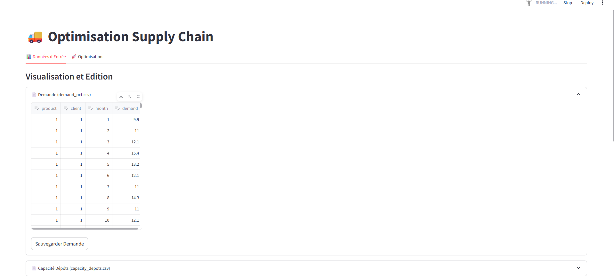
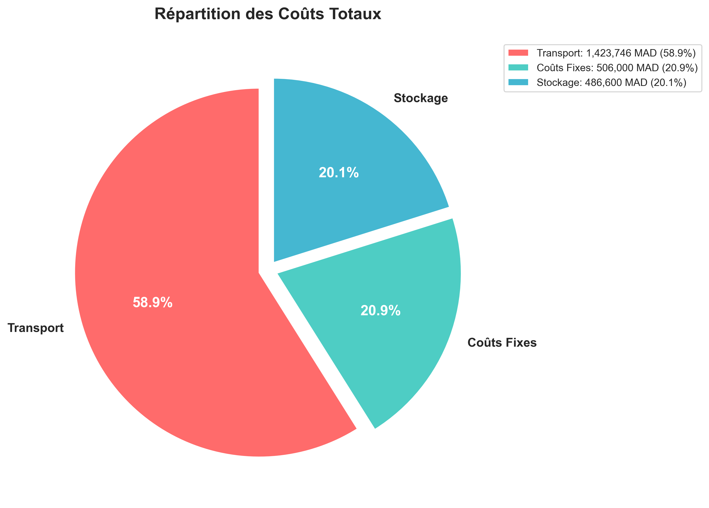
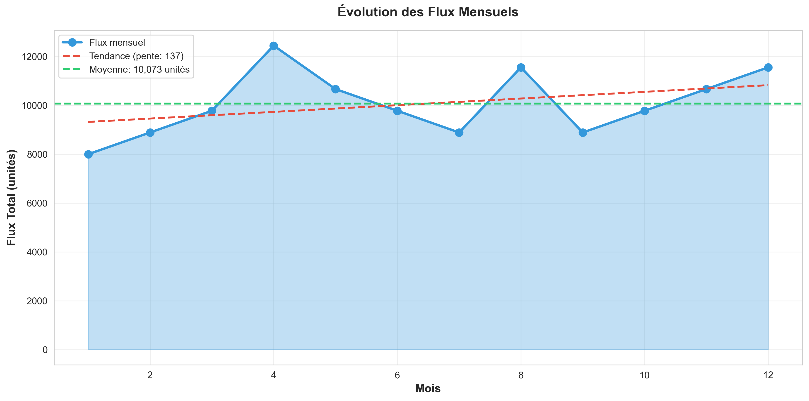

# Supply Chain Network Optimization (MILP)

Fait par: 
- Ayeman BOUGDIRA
- Ranya KSSIM
- Mohammed OUTAABOUT
- Aya El Kouach
# 📦 Supply Chain Network Optimization

Ce projet propose une solution d'optimisation pour un réseau logistique multi-échelons (Usines → Dépôts → Entrepôts → Clients) utilisant **Pyomo** et le solveur **GLPK**. L'application permet de minimiser les coûts totaux tout en respectant les contraintes de capacité et de demande.

## 🚀 Fonctionnalités
* **Modélisation MILP** : Optimisation des flux et de l'ouverture des sites (Binary variables).
* **Gestion Multi-période** : Planification sur 12 mois avec gestion des stocks initiaux et de sécurité.
* **Visualisation Interactive** : Interface Streamlit pour modifier les paramètres et visualiser les résultats en temps réel.

## 🛠️ Logique du Modèle
Le script calcule le coût minimal en équilibrant :
1.  **Coûts de Transport** : Entre chaque échelon du réseau.
2.  **Coûts Fixes** : Liés à l'ouverture des dépôts et des entrepôts.
3.  **Coûts de Stockage** : Basés sur les niveaux d'inventaire mensuels.


---

## 🧑‍💻 Utilisation de l'application

### 1. Installation
Exécutez les commandes suivantes dans votre terminal :

```bash
# Cloner le dépôt
git clone https://github.com/AyemanBougdira/Supply-chain-Network-Optimization.git

# Accéder au dossier
cd Supply-chain-Network-Optimization

# Installer les dépendances Python
pip install -r requirements.txt

# Installer le solveur GLPK (via Conda)
conda install -c conda-forge glpk

# Lancer l'application
streamlit run app.py
```
## 📦 Paramétre du Projet

Ce projet porte sur la **conception et l’optimisation d’un réseau logistique multi-échelons** à l’aide d’un **modèle de Programmation Linéaire en Nombres Entiers Mixtes (MILP)**.

Le réseau étudié comporte **quatre niveaux** :
- Usines
- Dépôts
- Entrepôts
- Clients

Le modèle est :
- **multi-produits**
- **multi-périodes (12 mois)**
- intégrant des **décisions stratégiques** (ouverture des sites),
- des **décisions tactiques** (flux),
- et des **décisions opérationnelles** (gestion des stocks).

L’objectif est de **minimiser le coût total** comprenant :
- les coûts de transport,
- les coûts fixes de location,
- les coûts de stockage,
tout en satisfaisant la demande et en respectant les contraintes de capacité et de stock de sécurité.

---

## Présentation de l'interface

## 🖥️ Interface de Gestion (Streamlit)
L'interface permet une gestion agile des paramètres logistiques avant le lancement du solveur.

### Visualisation et Édition
* **Modification en direct** : L'onglet "Données d'Entrée" permet de modifier les volumes de demande (ex: `demand_pct.csv`) directement dans l'application.
* **Sauvegarde** : Un bouton permet d'enregistrer les modifications pour mettre à jour les paramètres du modèle.



---

## 📈 Analyse des Résultats

### 1. Structure des Coûts
Le modèle cherche à minimiser la somme des coûts de transport, de stockage et des frais fixes.


* **Transport (58.9%)** : Le poste de dépense majeur, influencé par les flux entre usines, dépôts et clients.
* **Coûts Fixes (20.9%)** : Liés à l'activation binaire (`yD`, `yW`) des sites logistiques.
* **Stockage (20.1%)** : Coût de maintien de l'inventaire au fil des périodes.

### 2. Évolution des Flux et Capacités
Le réseau doit absorber une demande fluctuante tout en respectant les limites physiques des infrastructures.


* **Flux Mensuels** : On observe une moyenne de 10 073 unités avec une tendance légèrement haussière.


* **Saturation** : Plusieurs entrepôts atteignent **100% d'utilisation**, signalant des goulots d'étranglement critiques pour la croissance future.

### 3. Gestion des Stocks (Stratégie Juste-à-Temps)
Les graphiques de stock présentent des lignes horizontales constantes.


* **Interprétation** : Le solveur minimise les coûts de possession en ne stockant que le **Stock de Sécurité** (`ssD`, `ssW`) requis. 
* **Logique** : Toute unité supplémentaire stockée augmenterait le coût total sans bénéfice, car le transport est capable de répondre à la demande en flux tendu chaque mois.

---


## 🗂️ Structure du Répertoire

```text
.
├── Data/
│   ├── demand_pct.csv
│   ├── capacity_depots.csv
│   ├── capacity_warehouses.csv
│   ├── fixed_cost_depots.csv
│   ├── fixed_cost_warehouses.csv
│   ├── holding_costs.csv
│   ├── transport_factory_depot.csv
│   ├── transport_depot_warehouse.csv
│   ├── transport_warehouse_client.csv
│   ├── safety_stock_depots.csv
│   ├── safety_stock_warehouses.csv
│   ├── initial_stock_depots.csv
│   └── initial_stock_warehouses.csv
│
├
│── ├── model.py
│   ├── app.py
│ 
│ 
├── results/
│   ├── capacity_utilization.png
│   ├── cost_breakdown.png
│   ├── flux_evolution.png
│   ├── stock_evolution.png
│
│
│── packages.txt
├── README.md
└── requirements.txt
